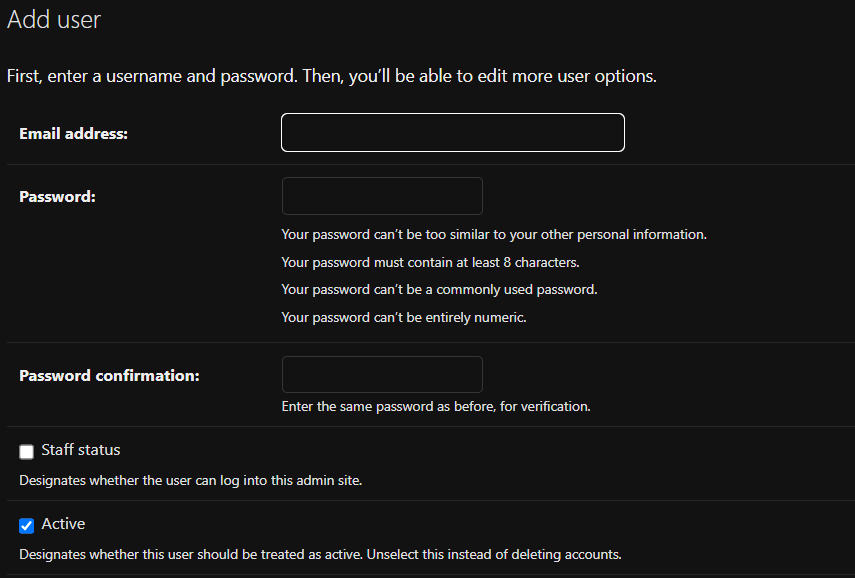

# Django Project

- ## Custom User
The First step is to create a custom user model. We will create a new app called `custom_user` and create a custom user model in it. We will also create a custom user manager for our custom user model.

```python
class CustomUser(AbstractUser):
    username = None
    email = models.EmailField(_("email address"), unique=True)

    USERNAME_FIELD = "email"
    REQUIRED_FIELDS = []

    objects = CustomUserManager()

    def __str__(self):
        return self.email
```

```python
class CustomUserManager(BaseUserManager):
    """
    Custom user model manager where email is the unique identifiers
    for authentication instead of usernames.
    """
    def create_user(self, email, password, **extra_fields):
        """
        Create and save a user with the given email and password.
        """
        if not email:
            raise ValueError(_("The Email must be set"))
        email = self.normalize_email(email)
        user = self.model(email=email, **extra_fields)
        user.set_password(password)
        user.save()
        return user

    def create_superuser(self, email, password, **extra_fields):
        """
        Create and save a SuperUser with the given email and password.
        """
        extra_fields.setdefault("is_staff", True)
        extra_fields.setdefault("is_superuser", True)
        extra_fields.setdefault("is_active", True)

        if extra_fields.get("is_staff") is not True:
            raise ValueError(_("Superuser must have is_staff=True."))
        if extra_fields.get("is_superuser") is not True:
            raise ValueError(_("Superuser must have is_superuser=True."))
        return self.create_user(email, password, **extra_fields)
```
In this custom user model, we have overridden the `USERNAME_FIELD` to `email` and set `REQUIRED_FIELDS` to an empty list. We have also created a custom user manager where we have overridden the `create_user` and `create_superuser` methods to create a user and superuser respectively.

We have also created a form to register a new user



## Installation
Clone the repository to your local machine using the following command:
```bash
git clone https://github.com/gigasamkharadze/tbc-django.git
```
Install the required packages using the following command:
```bash
pip install -r requirements.txt
```
Run the server using the following command:
```bash
python manage.py runserver
```